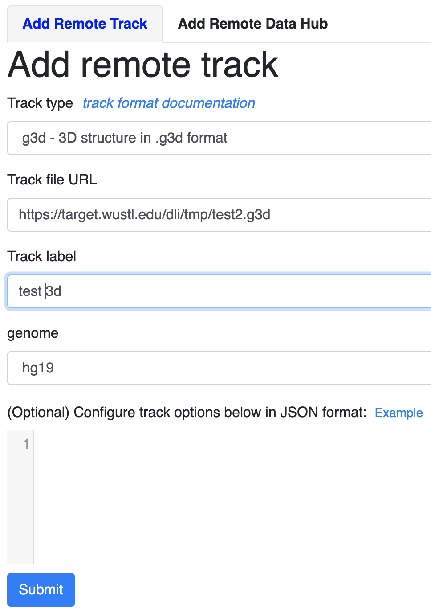
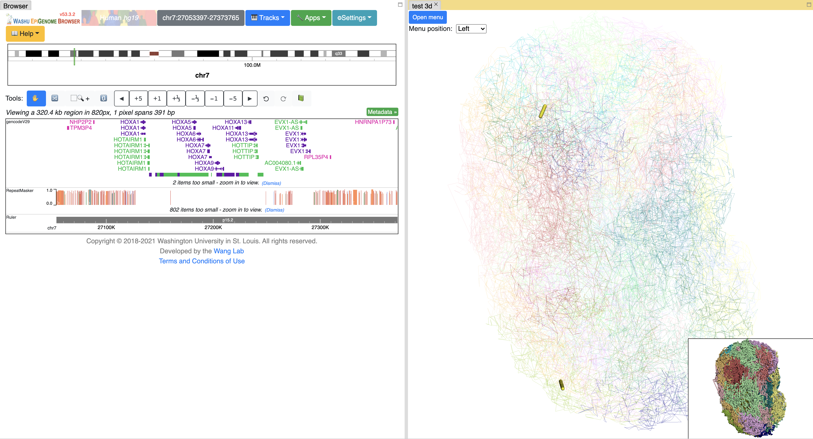
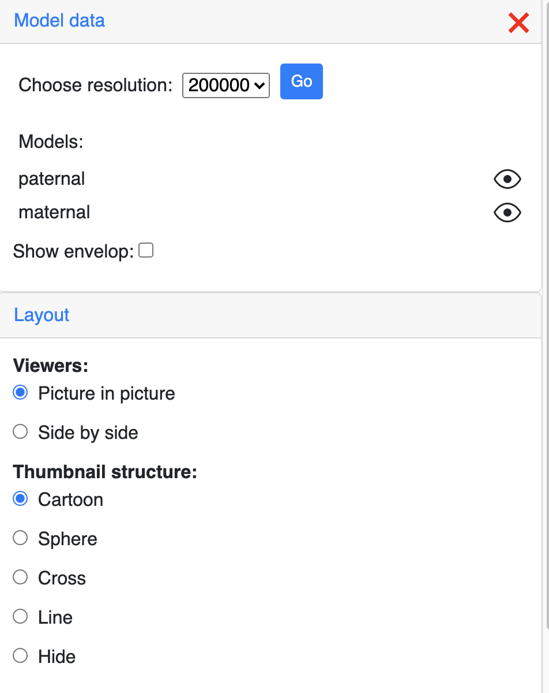
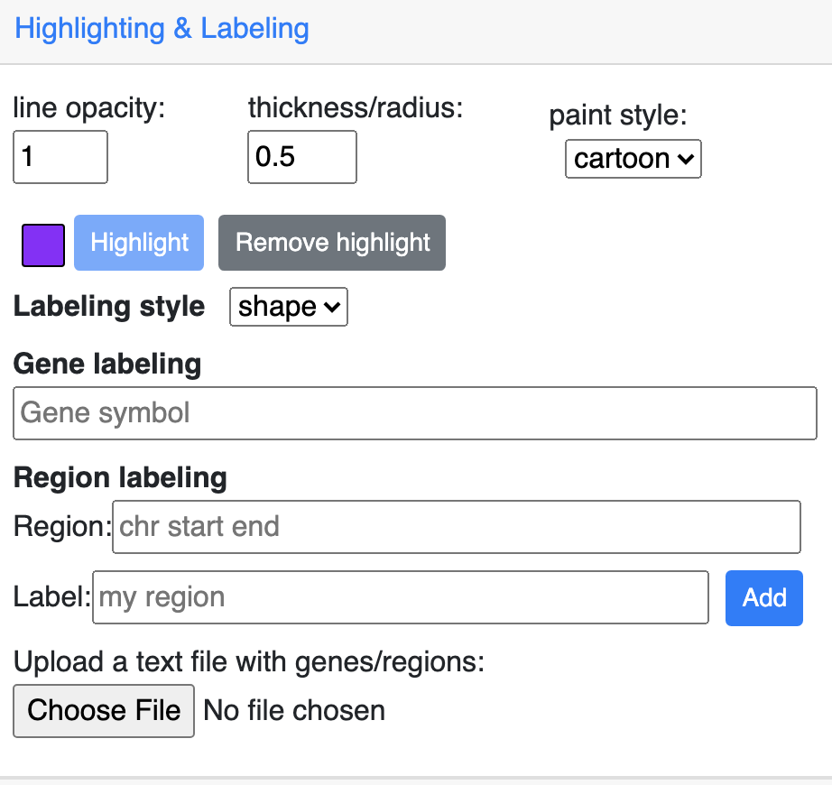
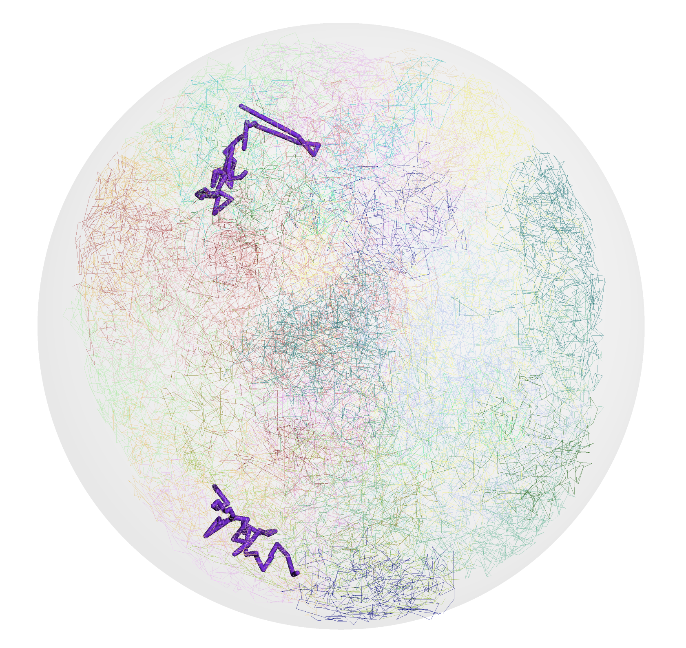
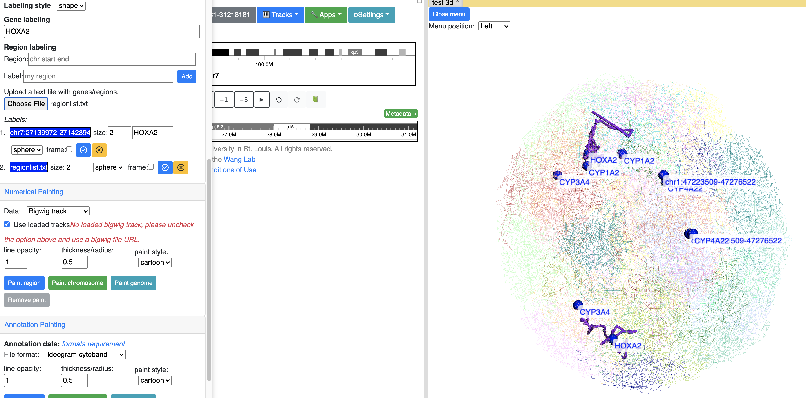
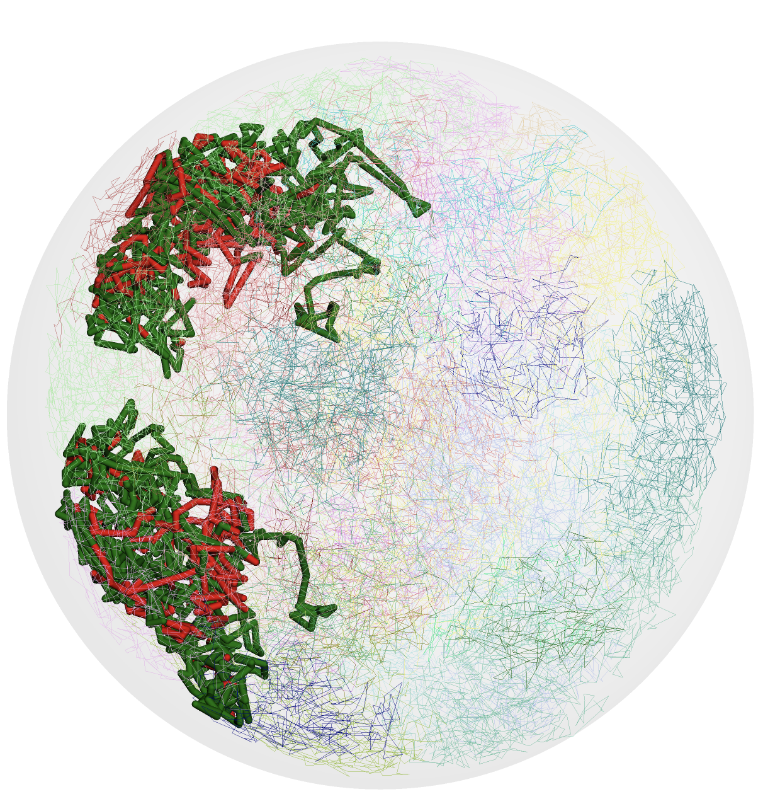

# 3D demo on WashU Epigenome Browser

## Generate .g3d file and submit it as a track

### install g3dtools

```bash
pip install g3dtools
```

Download the 3D result from this [GEO link](https://ftp.ncbi.nlm.nih.gov/geo/samples/GSM3271nnn/GSM3271347/suppl/GSM3271347_gm12878_01.impute3.round4.clean.3dg.txt.gz). This file is from [Three-dimensional genome structures of single diploid human cells. Science 2018 Aug 31;361(6405):924-928.](https://www.ncbi.nlm.nih.gov/pubmed/30166492)

### run g3dtools to generate .g3d file

```shell
g3dtools 3dg GSM3271347_gm12878_01.impute3.round4.clean.3dg.txt.gz -o test -n GM12878 -g hg19 -s 2,3,4,5,6,7,8,9,10
```

the generated `test.g3d` file can be upload to http server for being used as a remote track file or uploaded from local hard drive in next step.

### submit .g3d file to WashU Epigenome Browser

For demo purpose, I uploaded the file we generated to a [http location](https://target.wustl.edu/dli/tmp/test2.g3d). Submit this url as g3d track in browser.



This is how it looks like after initial load of a g3d track:



## Configure visualization

Click the **Open menu** button to open the configuration menu.

### configure resolution/model/layout

The top of the menu allows you to control resulution, model and layout settings.



### change highlighting/add labels

By default the 3D viewer highlights the region in current browser widow. Zoom in/out will update the highlight area.



View style can be customized by changing the color, opacity and thickness settings:



### files will be used

| File name                                                | Description                                               |
| -------------------------------------------------------- | --------------------------------------------------------- |
| loop22.colors.txt                                        | customized 4 column bed color file                        |
| loop22.bed                                               | bed file with loop positions                              |
| domains_nooverlap.bed                                    | bed file with domain positions                            |
| E003_15_coreMarks_dense.bed                              | chomHMM annotation                                        |
| 486778af-8f8e-4000-9812-409604e274a5.FPKM.cordinates.txt | gene expression results                                   |
| refGene.txt.gz                                           | refGene annotation from UCSC                              |
| regionlist.txt                                           | a text file contain a list of regions, one region per row |
| custom.colors.bed                                        | customized 4 column bed color file                        |
| 4DNFI4G2OZOI.txt                                         | A/B compartment annotation from 4DN                       |
| GSE63525_GM12878_subcompartments.bed                     | 6 compartment annotation from Rao et. al                  |
| GSE63525_GM12878_subcompartments.bed.gz                  | same as above but in gzipped format                       |

### add labels

Input gene symbol or genomic region for single labeling. Upload a file containing regions (for example `regionlist.txt`) for batch labeling.



### numerical painting

Add the GC percent track from annotation tracks, choose it from the dropdown menu of numerical painting section. Then click any of the paint button.


Alternatively, Choose _gene expression_ from the dropdown menu and upload the example file `486778af-8f8e-4000-9812-409604e274a5.FPKM.cordinates.txt`


### annotation painting

Click any of the paint button under annotation painting section, by default it will paint using cytoband data.


Choose the right menu option from the dropdown menu, and using the files provided in this repository, to play with annotation painting.

Would be able to create this view?



### export view as image

Under the Export section there are 2 buttons allow users to save the main and thumbnail stucture, respectively.
